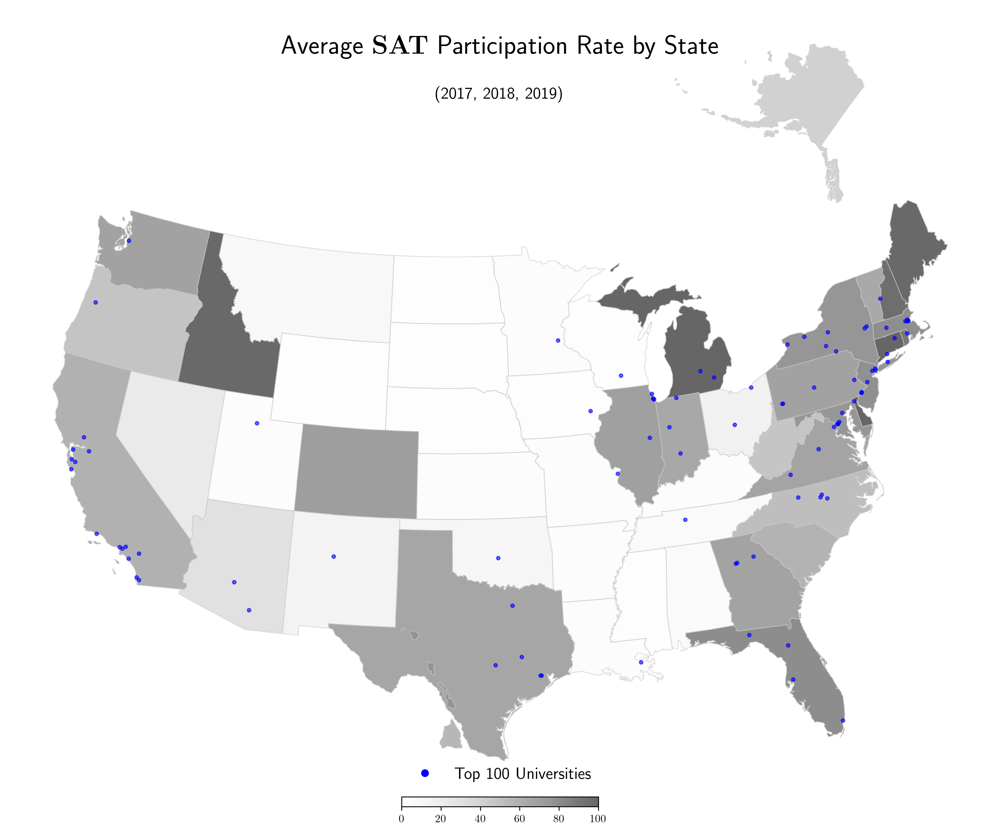
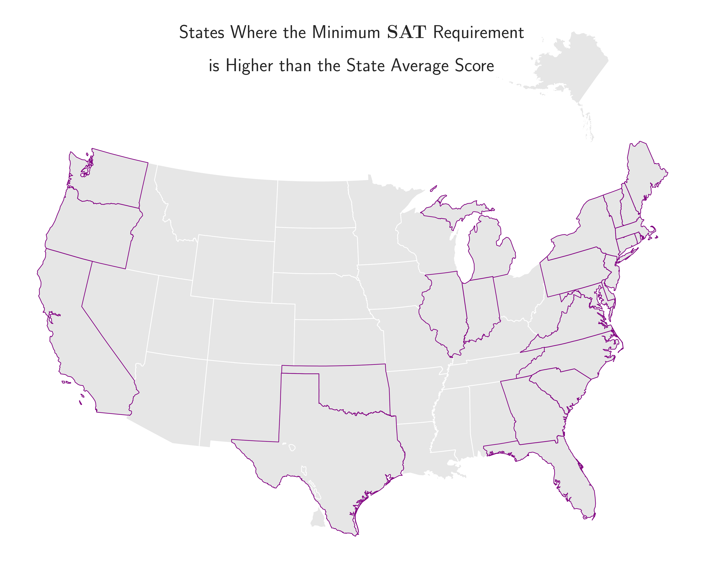

#  Project 1: Standardized Test Analysis
### Problem Statement
        
Figure out how the minimum college SAT/ACT requirements compare to the average of those scores in each state.
- In case the minimum requirement is higher than the state average, suggest solutions or further studies.

### Contents:
- [Problem Statement](#Problem-Statement)
- [Data Import & Cleaning](#Data-Import-and-Cleaning)
- [Tables](#Tables)
- [Data Visualization](#Visualize-the-Data)
- [Conclusions and Recommendations](#Conclusions-and-Recommendations)
- [Required Installations](#Required-Installations)

### Executive Summary

### Data Import & Cleaning

#### Original Data

The datasets included in the [`./data/original`](./data/original) folder.

| **Dataset** | **Description** |
| --------------- | ----------------- |
|[`act_2017.csv`](./data/original/act_2017.csv)| 2017 ACT Scores by State|
|[`act_2018.csv`](./data/original/act_2018.csv)| 2018 ACT Scores by State|
|[`act_2019.csv`](./data/original/act_2019.csv) | 2019 ACT Scores by State|
|[`sat_2017.csv`](./data/original/sat_2017.csv)| 2017 SAT Scores by State|
|[`sat_2018.csv`](./data/original/sat_2018.csv)| 2018 SAT Scores by State|
|[`sat_2019.csv`](./data/original/sat_2019.csv) | 2019 SAT Scores by State|
|[`sat_act_by_college.csv`](./data/original/sat_act_by_college.csv)| Ranges of Accepted ACT & SAT Student Scores by Colleges|

In this notebook, ACT & SAT scores by state for the given years are concatenated to a single table per each test.

| |Column|Dtype|Description|
|---|------  |-----  |---------- |
| 0   |state|object||
| 1   |participation  |object||
| 2   |ebrw           |int64 ||
| 3   |math           |int64 ||
| 4   |total          |int64 ||
| 5   |year           |object||
| 6   |test_type      |object||
|number of entries| 155      |||
|memory usage| 9.7+ KB      |||

- ACT


| |Column|Dtype|Description|
|---|------  |-----  |---------- |
| 0  | state          |object ||
| 1  | participation  |float64||
| 2  | english        |float64||
| 3  | math           |float64||
| 4  | reading        |float64||
| 5  | science        |float64||
| 6   |composite      |float64||
| 7  | year           |object ||
| 8   |test_type      |object ||
|number of entries| 156 (includes National)|||
|memory usage| 12.2+ KB      |||

For more details refer to the data cleaning [notebook](./code/01_Data_Import_Cleaning.ipynb).

### Conclusions & Recommendations

For the following states, where the average of minimum College SAT requirement is higher than the state average, the following are recommended:

- Introduce more preparatory SAT courses
- Start a collaborative process with the local high schools or other local colleges to raise the in-state SAT scores

|    | state          |
|---:|:---------------|
|  0 | California     |
|  1 | Connecticut    |
|  2 | Delaware       |
|  3 | Florida        |
|  4 | Georgia        |
|  5 | Illinois       |
|  6 | Indiana        |
|  7 | Maine          |
|  8 | Maryland       |
|  9 | Massachusetts  |
| 10 | Michigan       |
| 11 | New Hampshire  |
| 12 | New Jersey     |
| 13 | New York       |
| 14 | North Carolina |
| 15 | Oklahoma       |
| 16 | Oregon         |
| 17 | Pennsylvania   |
| 18 | Rhode Island   |
| 19 | South Carolina |
| 20 | Texas          |
| 21 | Vermont        |
| 22 | Virginia       |
| 23 | Washington     |


### Sources

#### Background information

- "ranked top 100 US universities" [source](https://www.topuniversities.com/where-to-study/north-america/united-states/ranked-top-100-us-universities)
- "which states require the SAT" [source](https://mindfish.com/which-states-require-the-sat/)
- "states that require the ACT" [source](https://blog.collegevine.com/states-that-require-the-act/)

#### Maps & Figures

I consulted these articles to figure out the setup for using geoPanda: 
- "why you should be using geopandas" [medium article](https://medium.com/@minaienick/why-you-should-be-using-geopandas-to-visualize-data-on-maps-aka-geo-visualization-fd1e3b6211b4)
- "mapping US states" [medium article](https://medium.com/@erikgreenj/mapping-us-states-with-geopandas-made-simple-d7b6e66fa20d)
- geopandas and matplotlib [towards-data-science article](https://towardsdatascience.com/lets-make-a-map-using-geopandas-pandas-and-matplotlib-to-make-a-chloropleth-map-dddc31c1983d)
- "Defining boundaries" [stack exchange post](https://gis.stackexchange.com/questions/281949/how-to-define-boundary-numbers-without-decimal-points-geopandas)
- geopandas user guides [docs 1](https://geopandas.org/docs/user_guide/mapping.html), [docs 2](https://geopandas.org/docs/user_guide.html)
- reduce legend size [stack overflow post](https://stackoverflow.com/questions/54236083/geopandas-reduce-legend-size-and-remove-white-space-below-map)
- legends filled with slash lines [stack overflow post](https://stackoverflow.com/questions/57067623/geopandas-plotting-with-legend-filled-up-with-slash-lines)

#### Other
- [Markdown images](https://towardsdev.com/3-ways-to-add-a-caption-to-an-image-using-markdown-f2ca30562be6)

### Tables

<details>
    <summary markdown="span">State where the average of minimum college SAT requirements is higher than the average SAT score in that state.</summary>
    
|    | state          |
|---:|:---------------|
|  0 | California     |
|  1 | Connecticut    |
|  2 | Delaware       |
|  3 | Florida        |
|  4 | Georgia        |
|  5 | Illinois       |
|  6 | Indiana        |
|  7 | Maine          |
|  8 | Maryland       |
|  9 | Massachusetts  |
| 10 | Michigan       |
| 11 | New Hampshire  |
| 12 | New Jersey     |
| 13 | New York       |
| 14 | North Carolina |
| 15 | Oklahoma       |
| 16 | Oregon         |
| 17 | Pennsylvania   |
| 18 | Rhode Island   |
| 19 | South Carolina |
| 20 | Texas          |
| 21 | Vermont        |
| 22 | Virginia       |
| 23 | Washington     |

</details>


<details>
    <summary markdown="span">State where the average of minimum college ACT requirements is higher than the average ACT score in that state.</summary>


|    | state          |
|---:|:---------------|
|  0 | Alabama        |
|  1 | Arizona        |
|  2 | Arkansas       |
|  3 | California     |
|  4 | Colorado       |
|  5 | Connecticut    |
|  6 | Delaware       |
|  7 | Florida        |
|  8 | Georgia        |
|  9 | Hawaii         |
| 10 | Illinois       |
| 11 | Indiana        |
| 12 | Iowa           |
| 13 | Kentucky       |
| 14 | Louisiana      |
| 15 | Maine          |
| 16 | Maryland       |
| 17 | Massachusetts  |
| 18 | Minnesota      |
| 19 | Mississippi    |
| 20 | Missouri       |
| 21 | Montana        |
| 22 | Nebraska       |
| 23 | Nevada         |
| 24 | New Hampshire  |
| 25 | New Jersey     |
| 26 | New York       |
| 27 | North Carolina |
| 28 | Ohio           |
| 29 | Oklahoma       |
| 30 | Oregon         |
| 31 | Pennsylvania   |
| 32 | Rhode Island   |
| 33 | South Carolina |
| 34 | Tennessee      |
| 35 | Texas          |
| 36 | Utah           |
| 37 | Vermont        |
| 38 | Washington     |
| 39 | West Virginia  |
| 40 | Wisconsin      |
| 41 | Wyoming        |
    
</details>


### Data Visualizations

|<b></b>|
|:--:|
|  |


    
|<b></b>|
|:--:|


|<b></b>|
|:--:|


|<b></b>|
|:--:|


|<b></b>|
|:--:|


|<b></b>|
|:--:|


|<b></b>|
|:--:|


|<b></b>|
|:--:|


|<b></b>|
|:--:|


|<b></b>|
|:--:|


|<b></b>|
|:--:|


|<b></b>|
|:--:|


|<b></b>|
|:--:|

    


### Required Installations


```
conda install -c anaconda beautifulsoup4           # fetching different sections of an html file
conda install requests                             # fetching website html
conda install -c conda-forge lxml                  # reading htmls into datatable


conda install -c conda-forge geopy                 # extracting location information from text
conda install --channel conda-forge geopandas      # maps
conda install -c conda-forge mapclassify           # maps

conda install -c conda-forge tabulate              # markdown conversion
```

